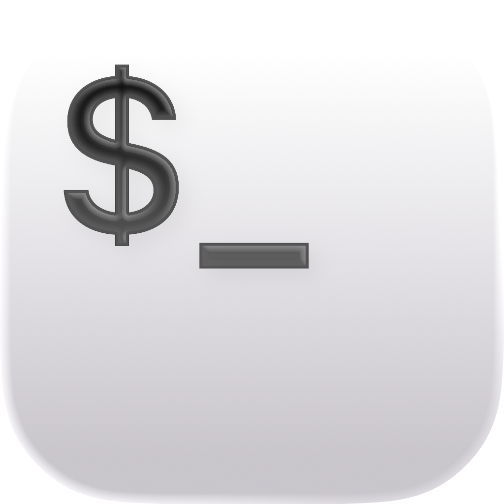
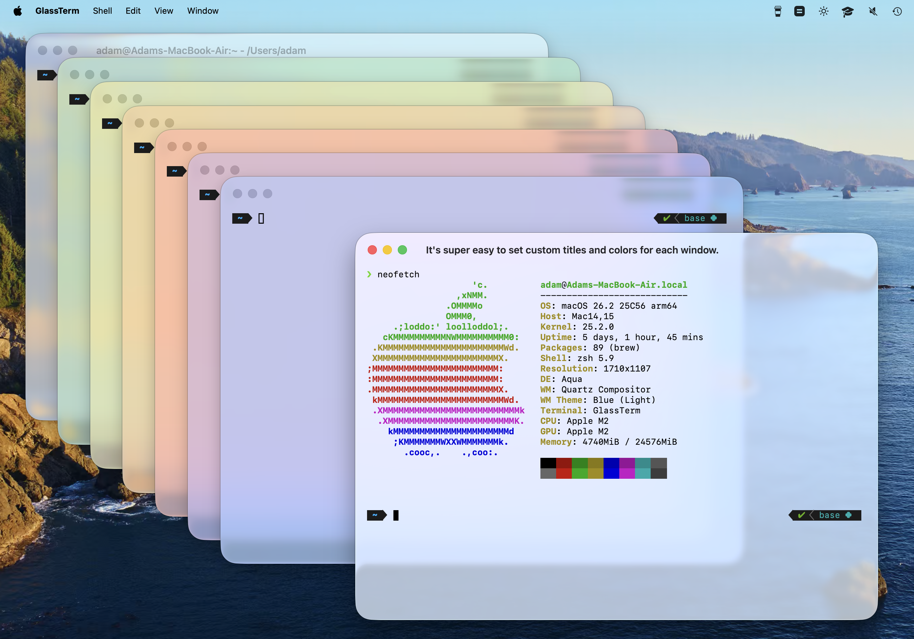

# GlassTerm
## A subjectively better-looking replacement for macOS Terminal.app





GlassTerm is a terminal emulator for macOS that embraces the Liquid Glass UI of macOS Tahoe, built using the excellent [SwiftTerm](https://github.com/migueldeicaza/SwiftTerm) library.  I built this mostly for myself, seeking a simple and lightweight but aesthetically pleasing terminal for my setup.  Configuration options are delibrately limited as a result. 

## Features

- Transparent Liquid Glass background
- Optional color tinting (per-window or global)
- Tabbing
- System color schemes for light/dark mode
- Font customization (style, size)
- That's about it (so far)!

## Requirements

- macOS 26.0 (Tahoe) or later

## Installation

Download from [Releases](https://github.com/adamlechowicz/GlassTerm/releases), or build from source:

```bash
git clone https://github.com/adamlechowicz/GlassTerm.git
cd GlassTerm
open TerminalApp/GlassTerm.xcodeproj
```

Then build and run in Xcode.

## Keyboard Shortcuts

| Action | Shortcut |
|--------|----------|
| New Window | ⌘+N |
| New Tab | ⌘+T |
| Close | ⌘+W |
| Bigger Font | ⌘++ |
| Smaller Font | ⌘+- |
| Reset Font | ⌘+0 |

## Credits

- [SwiftTerm](https://github.com/migueldeicaza/SwiftTerm) by Miguel de Icaza does all the heavy lifting

## License

MIT